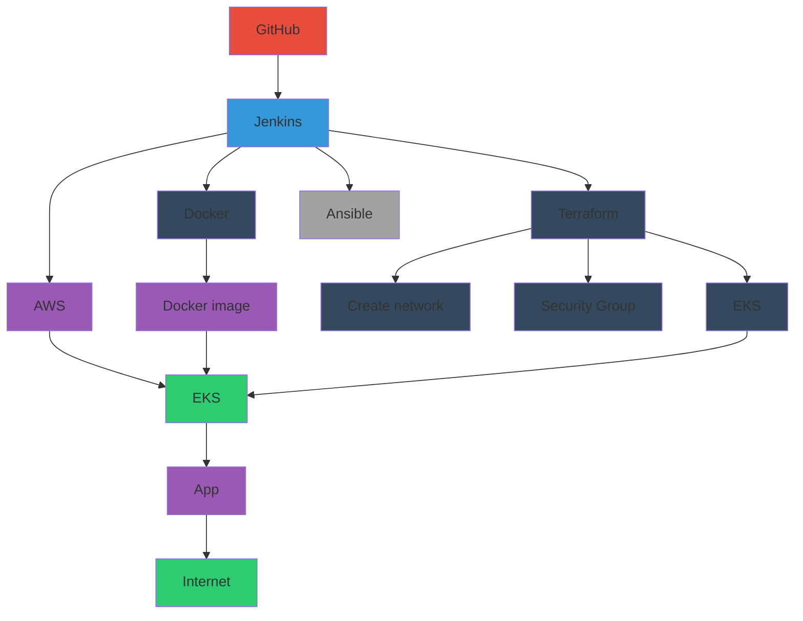

```mermaid
graph TD;
    A[GitHub] --> B[Jenkins]
    B --> C[AWS]
        C --> E[EKS]
    B --> D[Docker]
        D --> F[Docker image]
        F --> E
    B --> G[Terraform]
        G --> H[Create network]
        G --> I[Security Group]
        G --> J[EKS]
        J --> E
    B --> K[Ansible]
    E --> L[App]
    L --> M[Internet]
    
    style A fill:#e74c3c
    style B fill:#3498db
    style C fill:#9b59b6
    style D fill:#34495e
    style E fill:#2ecc71
    style G fill:#34495e
    style K fill:#a2a2a2
    style H fill:#34495e
    style I fill:#34495e
    style J fill:#34495e
    style F fill:#9b59b6
    style L fill:#9b59b6
    style M fill:#2ecc71

```