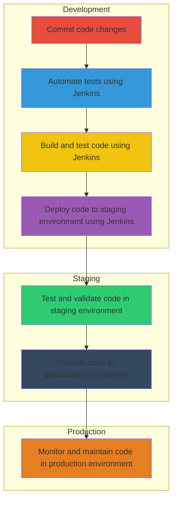

```mermaid
graph TD;
    subgraph Development
        A[Commit code changes] --> B[Automate tests using Jenkins]
        B --> C[Build and test code using Jenkins]
        C --> D[Deploy code to staging environment using Jenkins]
    end
    subgraph Staging
        D --> E[Test and validate code in staging environment]
        E --> F[Promote code to production environment]
    end
    subgraph Production
        F --> G[Monitor and maintain code in production environment]
    end
    style A fill:#e74c3c
    style B fill:#3498db
    style C fill:#f1c40f
    style D fill:#9b59b6
    style E fill:#2ecc71
    style F fill:#34495e
    style G fill:#e67e22
```