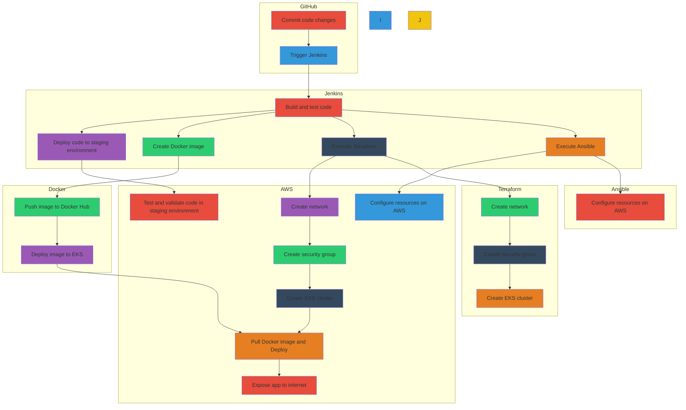

```mermaid
graph TD;
    subgraph GitHub
        A[Commit code changes] --> B[Trigger Jenkins]
    end
    subgraph Jenkins
        B --> C[Build and test code]
        C --> D[Deploy code to staging environment]
        C --> E[Create Docker image]
        C --> F[Execute Terraform]
        C --> G[Execute Ansible]
    end
    subgraph AWS
        D --> H[Test and validate code in staging environment]
        F --> K[Create network]
        K --> L[Create security group]
        L --> M[Create EKS cluster]
        M --> N[Deploy app to EKS]
        N --> O[Expose app to internet]
        G --> P[Configure resources on AWS]
    end
    subgraph Docker
        E --> Q[Push image to Docker Hub]
        Q --> R[Deploy image to EKS]
        R --> N[Pull Docker image and Deploy]
    end
    subgraph Terraform
        F --> S[Create network]
        S --> T[Create security group]
        T --> U[Create EKS cluster]
    end
    subgraph Ansible
        G --> V[Configure resources on AWS]
    end
    style A fill:#e74c3c
    style B fill:#3498db
    style C fill:#e74c3c
    style D fill:#9b59b6
    style E fill:#2ecc71
    style F fill:#34495e
    style G fill:#e67e22
    style H fill:#e74c3c
    style I fill:#3498db
    style J fill:#f1c40f
    style K fill:#9b59b6
    style L fill:#2ecc71
    style M fill:#34495e
    style N fill:#e67e22
    style O fill:#e74c3c
    style P fill:#3498db
    style Q fill:#2ecc71
    style R fill:#9b59b6
    style S fill:#2ecc71
    style T fill:#34495e
    style U fill:#e67e22
    style V fill:#e74c3c


```